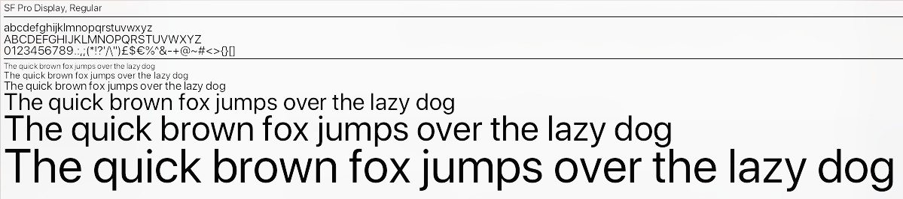
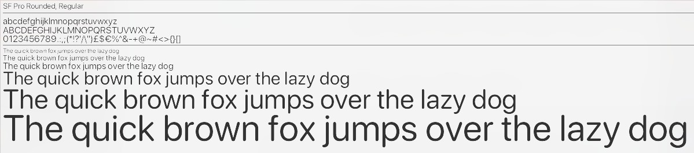
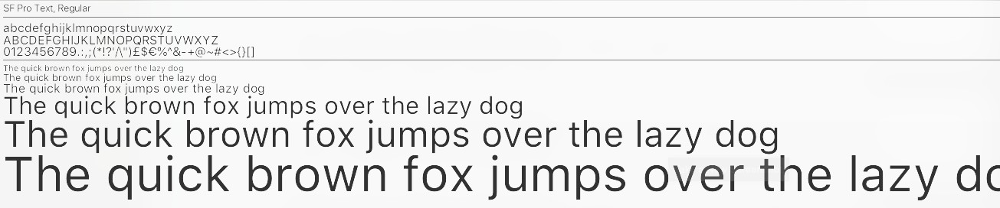

# San Francisco Fonts
**SF Pro Display**


**SF Pro Rounded**


**SF Pro Text**


## Downloading the fonts
* [Download the zip archive](https://codeload.github.com/MounirErhili/SF-Pro-Fonts/zip/refs/tags/v1.0.0)
    ```
    $ 7z x SF-Pro-Fonts-1.0.0.zip && cd SF-Pro-Fonts-1.0.0
    ```
* [Download the tar.gz archive](https://codeload.github.com/MounirErhili/SF-Pro-Fonts/tar.gz/refs/tags/v1.0.0)
    ```
    $ tar -xvpf SF-Pro-Fonts-1.0.0.tar.gz && cd SF-Pro-Fonts-1.0.0
    ```
* or clone this repository
    ```
    $ git clone https://github.com/MounirErhili/SF-Pro-Fonts.git && cd SF-Pro-Fonts
    ```

## Installing the fonts
```
$ sudo chmod a+x install.sh && sudo ./install.sh
```

## Coffee
In the past years I have spent quite some hours on open source projects. If you are the type of person who digs attention to detail, know how much work is involved in it and/or simply likes to support makers with a coffee or a beer I would greatly appreciate your donation on my [PayPayl](https://www.paypal.me/MounirErhili) account.
